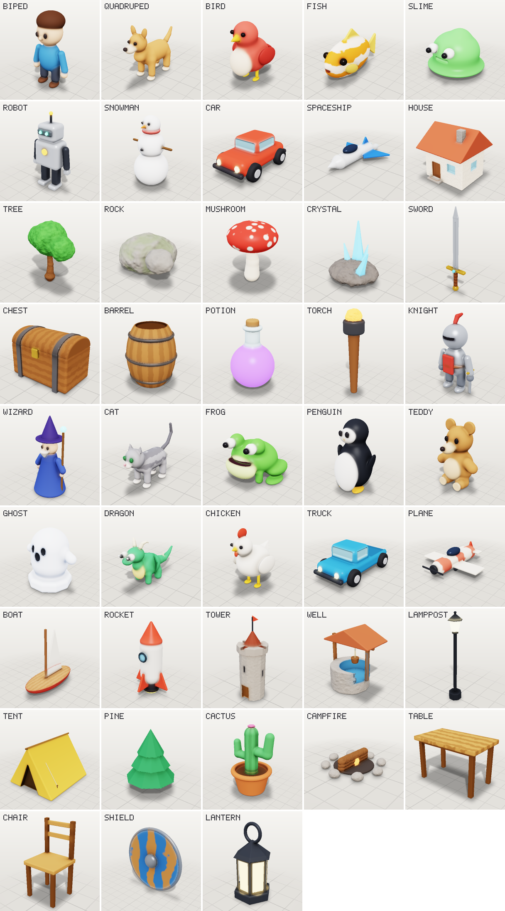
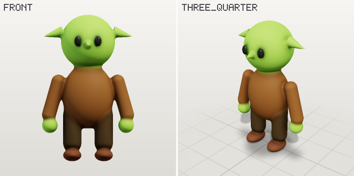
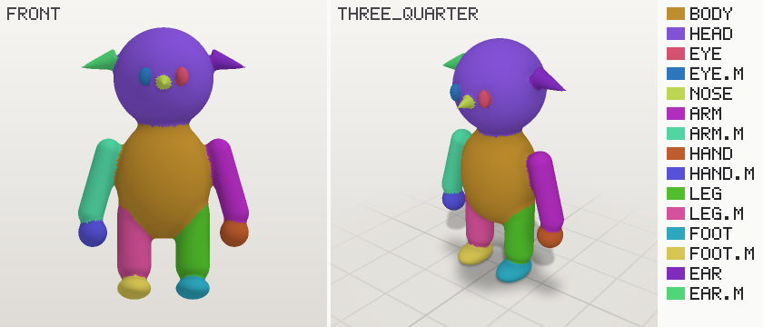
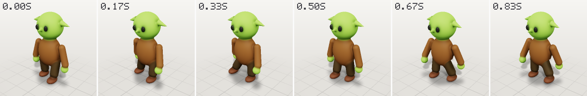
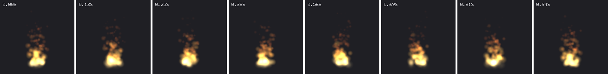

# Clayform

**A 3D workshop built for AI agents.** Agents model, sculpt, rig, animate and bake
effects by editing a semantic scene document. Clayform meshes it, renders it for them
to look at, measures what a picture can't show, and exports game-ready glTF.
No Blender, no GPU, no browser: it is a Node library with an MCP server.



*Every image in this README is a real Clayform render, regenerated by `scripts/`.*

## Why

Connecting a language model to a traditional 3D package works, but the model is
working blind with a low-level API. It writes vertex and coordinate code, has
trouble seeing what it made, and can't tell a floating ear from an attached one.
Clayform changes the medium instead:

| Problem for agents | Clayform's answer |
|---|---|
| Coordinates are where models make mistakes | Parts **attach** to each other's surface by side (`"on head, top"`), sink in by `embed`, and mirror themselves. Nothing can float by accident. |
| No sense of what is what | Every part has an id and a **role** (head, leg, wheel …). The **parts view** paints each one a color and prints a legend. |
| Can't see the result | A built-in **software renderer** returns labelled multi-view sheets (front, side, top, three-quarter) with ground and shadows as MCP images. |
| Can't judge the result from a picture | **Critics** measure: floating or split pieces, carves that cut a part in two, buried parts, detail too thin for the resolution, broken symmetry, models that would tip over, triangle budgets, and limbs that will stretch when animated. Every issue names the parts and says what to change. |
| Sculpting and keyframing are hand gestures | **Anchored sculpts** (`inflate the cheek, radius 6 cm`) and **intent clips** (`walk`, `fly`, `drive`, `wave` …) on an automatic rig. |
| Output isn't game-ready | glTF 2.0 with materials, vertex colors, skin and animations, reduced to a triangle budget. Validated with the Khronos glTF validator in the test suite. |

## Quick start

Requires Node 20+. Clayform installs straight from GitHub (it builds itself on install):

```bash
claude mcp add clayform -- npx -y github:sezginkipel/clayform mcp
```

For any other MCP client, the command is `npx -y github:sezginkipel/clayform mcp`.
Scenes are saved in `./.clayform/` (change it with `--workspace <dir>` or the
`CLAYFORM_WORKSPACE` environment variable).

To install a fixed version, use the prebuilt tarball from
[Releases](https://github.com/sezginkipel/clayform/releases):
`npm install https://github.com/sezginkipel/clayform/releases/download/v0.1.0/clayform-0.1.0.tgz`.
To work on the code: `git clone`, then `npm install` and `npm test`. Then ask your agent for something:
*"Make a goblin from the biped template, green skin, pointy ears, and export it
with a walk cycle."*

## What an agent does

```jsonc
// new_scene { "name": "Goblin", "template": "biped" }
// edit — one atomic batch:
[
  { "op": "set_palette", "set": { "skin": "#7fb04a", "shirt": "#6b4a2b", "pants": "#3d3322" } },
  { "op": "update_part", "id": "hair", "set": { "hidden": true } },
  { "op": "add_part", "part": {
      "id": "ear", "role": "ear", "shape": { "type": "cone", "height": 0.16, "radius": 0.045 },
      "attach": { "to": "head", "side": "left", "offset": [0, 0.2], "align": true, "embed": 0.2 },
      "rotation": [0, 0, -25], "mirror": true, "blend": 0.02, "material": { "color": "skin" } } },
  { "op": "update_part", "id": "nose", "set": {
      "shape": { "type": "cone", "height": 0.09, "radius": 0.03 },
      "attach": { "to": "head", "side": "front", "offset": [0, -0.1], "align": true, "embed": 0.2 } } }
]
```

| `render` | `render` with `mode: "parts"` |
|---|---|
|  |  |

`preview_motion { "clip": "walk" }`:



`preview_effect` on the torch template's `fire` preset:



Critic output looks like this (from a deliberately broken edit):

```
size 1.00 × 1.32 × 0.46 m · 31,412 triangles · 2 body islands · built in 226 ms
ERROR [floating] orb is not connected to the rest of the body — use attach, raise embed, or mark it separate if it should be its own mesh
WARN [asymmetric] declared X symmetry is off by 1.3 cm on average; worst: orb (43.1 cm) — use mirror: true instead of hand-placing both sides
```

## MCP tools

| Tool | What it does |
|---|---|
| `guide` | The manual an agent reads once (topic `schema` returns the full JSON Schema) |
| `list_templates` | 19 tuned starting points: biped, quadruped, bird, fish, slime, robot, snowman, car, spaceship, cottage, tree, rock, mushroom, crystal, sword, chest, barrel, potion, torch |
| `new_scene` · `list_scenes` · `get_scene` · `import_scene` | Scenes in the workspace; `get_scene` summarizes parts with resolved world positions |
| `edit` | Atomic batch of ops (add/update/remove/rename/duplicate parts, sculpts, clips, effects, settings, palette). Returns what changed and the critics |
| `render` | Labelled multi-view PNG; modes `shaded`, `parts`, `clay`, `normals`, `depth` |
| `inspect` | Part summary, critics, and a ground-contact check of every clip |
| `preview_motion` | A clip as a labelled film strip |
| `preview_effect` | An effect's frames |
| `export` | `glb` · `obj` · `json` · `flipbook` (sprite sheet PNG + JSON), with an optional triangle budget |
| `history` | Undo, redo, named snapshots |

## The scene document

Meters, +Y up, the model faces +Z, the model's left is +X. The full reference is in
[`src/guide.ts`](src/guide.ts) (the text the `guide` tool returns).

- **Shapes:** sphere, ellipsoid, box, capsule, cylinder, cone (both optionally faceted with
  `sides`), torus, prism, tube (a swept tube with per-point radius, for tails, limbs, horns).
- **Combining:** `add` with a smooth `blend` radius, `carve`, `intersect`; `pattern`
  (spots, stripes, noise, gradient), `detail` (surface displacement).
- **Sculpts:** inflate, dent, flatten, crease, noise, anchored to a part and side or a point.
- **Clips:** idle, walk, run, hop, fly, swim, drive, spin, hover, wave, nod, or keyframes, with
  keyframe tracks layered on top.
- **Effects:** fire, smoke, sparks, magic, explosion, dust, snow, rain, bubbles, heal. Every
  parameter can be overridden, and the particle paths are closed-form, so loops are exactly periodic.

## CLI

```bash
clayform templates
clayform render biped --mode parts -o biped.png
clayform inspect my-scene.clay.json      # exit code 2 when critics report errors
clayform export my-scene.clay.json -o hero.glb --triangles 3000
clayform motion quadruped walk -o walk.png
clayform effect torch -o fire.png        # sprite sheet + .json + .preview.png
```

## As a library

```ts
import { getTemplate, buildScene, critique, renderSheet, simplifyBuild, exportGlb } from 'clayform';

const build = buildScene(getTemplate('robot')!.scene);
console.log(critique(build).issues);
const png = renderSheet(build, { mode: 'parts' }).png;
const glb = exportGlb(await simplifyBuild(build, { triangles: 4000 })).glb;
```

## How it works

1. **Resolve** parts in dependency order. Attached parts are placed by sphere-tracing the
   target's own distance field from the requested world side (without an offset, the
   extreme point that way), then sunk in by `embed`. Mirror twins are exact reflections.
2. **Mesh** the signed distance field (smooth-min unions, carves, intersections, sculpt
   modifiers) with surface nets on a block-culled grid. Only the shell near the surface is sampled.
3. **Attribute** every vertex: normal from the field gradient, ambient occlusion from the
   field, blended part color and pattern, dominant part, and skin weights restricted to
   the dominant part's parent and children.
4. **See**: a deferred software rasterizer (triangle ids + barycentrics, then one shading
   pass) draws the mesh, an analytic ground plane, a projected key shadow and a soft
   contact shadow. Labels use a built-in 5×7 bitmap font.
5. **Measure**: connected components, the volume centroid against the ground-contact hull,
   mirrored field sampling, and per-part visibility and thickness.
6. **Export**: quadric simplification (meshoptimizer) that keeps color, normal and material
   borders, then GLB with one primitive per material, a joint per part, and sampled animations.

## Limits (today)

- The look is **stylized**: smooth, clay-like, vertex-colored. There are no UV textures or
  photoreal materials. Hard mechanical edges are rounded at the cell size, so raise
  `resolution` for crisp props.
- It does **not** generate organic detail from a text or image model yet. Hand-off to an
  image-to-3D model is on the roadmap.
- Animation is procedural plus keyframes, with no physics, IK or retargeting. Motion critics
  check ground contact only.
- The renderer is for judging shape and color. It is not a final-quality renderer.
- Nobody has run the bench yet ([`bench/`](bench/README.md)), so this README makes no
  quality comparison.

## Roadmap

- Image/text-to-3D hand-off (open-weight models or hosted APIs), imported meshes as parts
- Texture baking (UVs via xatlas) and a texture atlas export
- Two-segment limbs with simple IK for walk cycles on uneven ground
- A browser viewer (`clayform view`) for people
- Publishing the bench run against other agent 3D tools

## Development

```bash
npm test                              # 34 tests, including the Khronos glTF validator
npm run check                         # types
npx tsx scripts/gallery.ts            # regenerate docs/gallery.png
npx tsx scripts/docs-images.ts        # regenerate the README images
npx tsx scripts/bench.ts <dir>        # score a bench run
```

See [CONTRIBUTING.md](CONTRIBUTING.md).

## License

[Apache-2.0](LICENSE) © Sezgin Kipel
