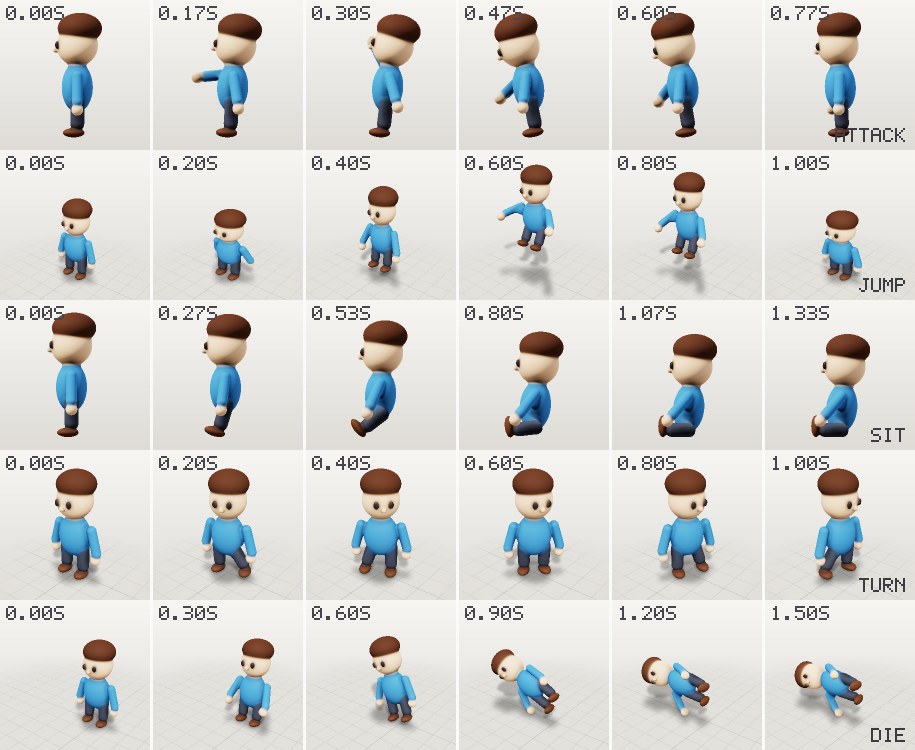

# Animation

## The rig builds itself

When a scene has clips, every part becomes a joint at its **pivot**, under a `root` joint on the
ground. The hierarchy follows `attach` and `parent`. Skin weights stay on a vertex's own part and
its parent and children, so a hand that rests near a hip never follows the leg.

Rest rotations are identity, so a joint rotation means "turn this part about its pivot, in world
axes". A leg swing is `rotation: [30, 0, 0]`.

### Pivots

- By default the pivot is where the part attaches. Otherwise it is the top of a `leg` or `arm`,
  the bottom of a `head` or `neck`, and the center of anything else.
- Override with `pivot`: `center`, `top`, `bottom`, `front`, `back`, `left`, `right`,
  `attach`, or a local `[x, y, z]`.

### Roles drive the motion

| role | walk / run | idle | hop | fly | swim | drive / hover |
|---|---|---|---|---|---|---|
| `leg` | steps with planted feet (IK) | still | tucks | tucks back | — | — |
| `arm` | counter-swings its side's leg | sways | lifts | — | paddles | — |
| `head` | nods and turns a little | looks around | — | — | counter-turns | — |
| `tail` | sways | sways | flicks | trails | beats | — |
| `wing` | small flap | settles | — | flaps | fin strokes | — |
| `ear` | bounces | twitches | flops | — | — | — |
| `wheel` | rolls | — | — | — | — | rolls (drive) |
| `rotor` | — | slow spin | — | spins | — | spins |

Gait comes from the legs: two legs alternate, four legs trot diagonally, and six or more move
in alternating tripods.

### Planted feet

`walk` and `run` plant the feet. Each foot slides back along the ground while it is down
(60% of a walk cycle, 38% of a run, so a run has short flights) and swings forward through the
air. The legs are solved to those targets:

- A leg with a knee (a `leg` part whose child is also a `leg`) uses two-bone IK. The knee bends
  the way it bends at rest, or forward when the leg is straight.
- A rigid leg turns at the hip. The root drops just enough for the stance feet to reach the
  ground, the steps stay short enough that the drop is under a cell, and the swinging leg tips
  outward a little to clear the ground.
- Parts on the bottom of a leg (a boot or a paw) stay level, so the sole does not rock.

The feet move back at the clip's speed, which is exported as the animation's `extras.speed`
(m/s). Move the character at that speed and the feet stay put in the world. A leg is planted
only if it hangs down from its hip and reaches the ground at rest. Flat flipper-feet and legs
in a sitting pose keep the simple swing.

Measured on the templates' walks (biped, robot, knight, quadruped, cat, chicken, baby dragon):
a foot moves at most 0.3 cm between touchdown and lift-off, except the baby dragon's right front
foot at 1.1 cm. A cell is 0.4–1.1 cm on those models.

### Follow-through

Tails, ears, antennas and hair (`tail`, `ear`, `antenna`, `hair` roles) get secondary motion on
top of their own sway. The tip of each is a point on a damped spring that chases where the tip
would be if the part were rigid: when the body turns, the tail trails, swings past when the body
stops, and settles. The lag becomes an extra turn at the part's pivot, baked into the clip, and
chained parts (a tail made of several `tail` parts) each follow the one before. Looping clips are
simulated for three cycles and the last one is kept, so the clip still loops. Ears spring at
3.5 Hz, antennas at 3, hair at 2.5 and tails at 2.2, all with the same light damping.

`"secondary": false` on a clip turns it off.

## Clip types

**Loops:** `idle`, `walk`, `run`, `hop` (with squash and stretch), `fly`, `swim`, `drive`, `spin`
(the `target` or the whole model), `hover`, `wave` (the `target` arm, or the one on the model's
right), `nod`.

**Game actions** play once and are built from roles, so they work on any model:

| clip | what happens | without arms / legs |
|---|---|---|
| `attack` | wind up with the arm overhead, chop forward and down, come back; the body leans into it over planted feet | the head lunges and snaps |
| `jump` | crouch with a squash, leave the ground in a ballistic arc with the legs tucked and arms up, land with a squash | still jumps; nothing to tuck |
| `sit` | two legs: sit on the ground with the legs forward. Four or more: fold the back legs under and sit up on the front ones. Stays seated | sinks down |
| `turn` | a quarter turn to the left in place, in three small steps per foot (in the gait's pairs), the body following the feet | the body turns |
| `die` | stagger back, tip over onto the right side with gravity, a small bounce, lie still | falls the same way |



**Reach and look** take a place, `at`: a world point `[x, y, z]` in meters (the model stands on
y = 0 and faces +Z) or a part id, meaning that part's center.

| clip | what happens | default `at` |
|---|---|---|
| `reach` | the hand goes to the point, holds, comes back; the head looks at it | in front of the shoulder |
| `point` | the arm straightens toward the point and holds longer | ahead and a little up |
| `pickup` | bends at the hips just far enough for the hand to reach, feet planted, then stands up | the ground in front |
| `look` | the head turns to the point (up to 75° to the side and 40° up or down), the eyes take up to 20° more, then back | none, `at` is required |

<!-- verify: clip biped -->
```json
{ "id": "grab", "type": "reach", "at": [-0.25, 0.55, 0.3] }
```

The arm is the `target`, or the one on the model's right. An arm in two parts (an `arm` attached
under an `arm`) bends at the elbow and touches the point with its fingertip. The elbow bends the
way it bends at rest, or down and back if the arm is straight. A one-piece arm is rigid: it turns
to aim its tip at the point, and a point out of reach is pointed at. Either way the solve is
against the pose of everything above the arm, so it holds while the body leans. The test suite
checks that the fingertip ends within a cell and a half of the point (two parts), that the aim is
within 2° (one piece), and that during `pickup` the hand is at the ground while the feet stay put.

`lookAt` on any clip keeps the head on a point for the whole clip, on top of its own motion:

```json
{ "id": "walk_watching", "type": "walk", "lookAt": [1, 1.2, 0.8] }
```

`sit` and `die` keep the model's lowest point on the ground the whole way, so it tips over the
edge it rests on instead of sinking or floating. `amplitude` scales every action (a turn of
`amplitude: 2` is a half turn).

`speed` multiplies the cycle rate, `amplitude` the motion size, `duration` sets the length (the
default is one natural cycle, so loops loop), and `fps` the export sample rate.

## Faces

`expressions` are faces a model can make. Each one is written as what changes: parts moved,
rescaled, reshaped or bent (merged like `update_part`), and sculpts added. A `preset` starts from
a built-in face:

| preset | what it does | needs |
|---|---|---|
| `blink` | squashes the eyes shut: the eyes' own whites and pupils when they have them, otherwise the eyes | parts with role `eye` |
| `smile`, `frown` | bends the mouth so its corners rise (or drop) by about a third of its width | a part with role or id `mouth` |
| `open_mouth` | opens the mouth three times as tall and a little deeper | a mouth part |
| `surprise` | a round open mouth and wider eyes | a mouth part |

```json
"expressions": [
  { "id": "blink", "preset": "blink" },
  { "id": "smile", "preset": "smile" },
  { "id": "open_mouth", "preset": "open_mouth" },
  { "id": "wink", "parts": { "eye": { "scale": [1, 0.1, 1] } } }
]
```

Clips show them: `blink` loops a blink every 3.2 s, `talk` opens and closes the mouth in six
syllables and a pause (and bobs the head a little), `expression` fades one in, holds it and fades
it out. `face` on any clip holds expressions at a weight for the whole clip:

```json
{ "id": "hop_happy", "type": "hop", "face": { "smile": 1 } }
```

Export writes every expression as a glTF morph target (named in the mesh's `extras.targetNames`,
the convention three.js, Godot and Blender read) on each mesh an expression moves, and each clip
with a face as a `weights` animation. Motion strips (`preview_motion`) show the face too.

How it works, and what follows from it: an expression never changes the triangles. Each vertex of
the model as exported (after its triangle budget) rides with the part it belongs to, then settles
onto the expression's surface. The target is the difference from the same settle onto the
unchanged surface, so the parts an expression does not touch do not move. Three consequences:

- **Colors ride with their vertices.** A mouth's dark vertices move with the mouth as it bends or
  opens. But an eye blended into the face cannot hide its white when it closes: those vertices
  stay white, as a streak. The critic warns about this. Give the eye's inner parts `separate: true`
  and the blink is clean.
- **The budget limits the face.** A tight triangle budget leaves few vertices around the mouth, and
  the expression is only as fine as they are. The export reports how many vertices each expression
  moves, and one that moves none is named.
- **Big changes stretch.** A mouth opened far pulls the triangles around it. Presets stay within
  what reads well at the default resolution.

The test suite checks that moved vertices land on the expression's surface, that parts an
expression does not change do not move, that the mouth's own vertices follow a smile to its
corners, and that the export has no validator errors or warnings.

## Cloth

`cloth` on a separate part (a sheet is always separate) makes it ripple in every clip: a flag on
its pole, a cape, a sail, a banner. The `wind` clip plays nothing else, for props.

<!-- verify: part flagpole -->
```json
{ "id": "banner", "role": "flag", "shape": { "type": "sheet", "size": [0.5, 0.3] },
  "attach": { "to": "pole", "side": "left", "offset": [0, 0.3], "embed": 1 }, "position": [0.27, 0, 0],
  "cloth": { "wind": 6 } }
```

`pin` is the edge held still, in the part's own frame: `left` by default for role `flag`, `top`
otherwise (a cape at the shoulders). `wind` (m/s, default 4) sets how fast the waves run, a third
of the wind, and how big they get. `amplitude` (default a tenth of the length at wind 4) and
`wavelength` (default seven tenths of the length) set the waves directly. Parts with role `cape`
or `cloth` also swing behind the body on a spring, like tails.

The ripple is a travelling wave that grows from the pinned edge, exported as four morph targets
per part (named `<part>_flutter0` to `3`). Their weights are the positive and negative halves of
the wave's cosine and sine, so every weight stays between 0 and 1 and engines that refuse
negative morph weights play it too. Loops fit a whole number of waves, so they have no seam. The
test suite checks that the four targets add up to the wave at any phase, that the pinned edge
does not move, and that loops start and end on the same weights. It is a wave, not a cloth
simulation: nothing collides, and a flag does not wrap around its pole.

## Blending clips

A `blend` clip crossfades from one clip into another:

<!-- verify: clip biped -->
```json
{ "id": "walk_to_idle", "type": "blend", "from": "walk", "to": "idle", "duration": 0.4 }
```

The first clip keeps playing from its start while its weight eases out, and the second is timed
so it reaches its own first frame exactly when the blend ends. Play the blend, then the `to`
clip from its start, and there is no seam. Both clips must be ordinary clips in the same scene.

Engines can also blend at runtime, and the clips are made for it:

- **Loops start and end on the same pose**, and the one-shots start from rest and end at rest
  (or in their final pose for `sit`, `turn` and `die`), so a short crossfade (0.15–0.3 s) between
  any two of them never pops.
- **`walk` and `run` share a phase**: at the same normalized time, the same foot is forward. Blend
  them by normalized time (Godot `AnimationNodeBlendSpace1D` with sync, Unity blend trees, Unreal
  blend spaces), not by seconds, and the feet stay in step.
- **Match the movement speed** to `extras.speed` on the walk and run animations. A blend space
  between them works best with the parameter set to those two speeds.

<!-- verify: clip biped -->
```json
{ "id": "wave_hello", "type": "wave", "target": "arm", "amplitude": 1.2 }
```

## Keyframes

Tracks turn and offset parts about their pivots, eased in and out, and layer on top of a procedural
clip (or stand alone with `type: "keyframes"`):

<!-- verify: clip biped -->
```json
{ "id": "look_back", "type": "keyframes", "duration": 2,
  "tracks": [
    { "part": "head", "keys": [ { "t": 0, "rotation": [0, 0, 0] }, { "t": 1, "rotation": [0, 70, 0] }, { "t": 2, "rotation": [0, 0, 0] } ] },
    { "part": "arm.m", "keys": [ { "t": 0, "rotation": [0, 0, 0] }, { "t": 1, "rotation": [0, 0, -40] }, { "t": 2, "rotation": [0, 0, 0] } ] }
  ] }
```

Mirror twins are addressed as `<id>.m`.

## Checking motion

`preview_motion` renders frames from one camera framed on the whole clip, so movement reads as
movement. `inspect` samples every clip and reports parts passing through each other, sinking
below the ground, never touching it, feet sliding while they are down (the same sole points are
followed from touchdown to lift-off, against the clip's speed), or not moving at all. The `fused-unrelated` critic warns
*before* you animate when two moving parts are fused.

## Limits

No physics or retargeting. Feet are planted on flat ground only, and arms do not use IK. See the
[roadmap](../ROADMAP.md).
