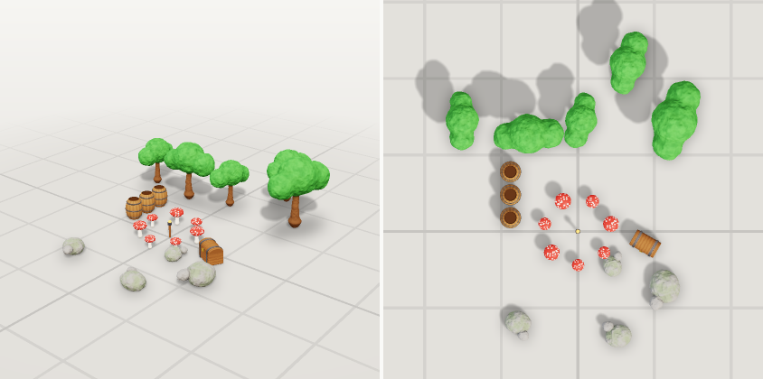

# Layouts

A layout places many objects together: a camp, a street, a dungeon corner, a forest patch. It
refers to scenes (by workspace id or `.clay.json` path) or templates, so each object is modeled once
and reused.



This is [`examples/camp.layout.json`](examples/camp.layout.json):

```json
{
  "format": "clayform-layout/1",
  "name": "Camp",
  "items": [
    { "id": "fire", "scene": "torch", "position": [0, 0] },
    { "id": "chest", "scene": "chest", "position": [2.2, 0.4], "rotation": -30 }
  ],
  "patterns": [
    { "id": "shroom", "scene": "mushroom", "type": "circle", "count": 7, "radius": 1.1, "rotate": "random", "scaleJitter": 0.25, "seed": 3 },
    { "id": "barrel", "scene": "barrel", "type": "row", "count": 3, "spacing": 0.75, "origin": [-2.2, -1.2], "direction": 90 },
    { "id": "tree", "scene": "tree", "type": "scatter", "count": 5, "area": [9, 5], "origin": [0, -3.8], "minGap": 1.8, "rotate": "random", "scaleJitter": 0.2, "seed": 11 },
    { "id": "rock", "scene": "rock", "type": "scatter", "count": 4, "area": [7, 3], "origin": [0, 2.6], "minGap": 1.5, "rotate": "random", "scaleJitter": 0.3, "seed": 5 }
  ]
}
```

## Items

`{ id, scene, position, rotation?, scale? }`. `position` is `[x, z]` on the ground or `[x, y, z]`.
`rotation` turns the object around Y, in degrees. Objects already stand on the ground (their scenes
are grounded), so `[x, z]` is usually all you need.

## Patterns

`{ id, scene, type, count, … }`. Items get ids `<id>_1`, `<id>_2` …

| type | uses | places items |
|---|---|---|
| `row` | `spacing`, `direction` (degrees) | in a line centered on `origin` |
| `grid` | `spacing`, `columns` | in a grid centered on `origin` |
| `circle` | `radius` | evenly around `origin` |
| `scatter` | `area: [w, d]`, `minGap`, `seed` | randomly in the area, at least `minGap` apart |

`rotate` is `none`, `random`, `face_center`, `face_out` or a number of degrees. `scaleJitter: 0.2`
varies sizes by ±20%. The same `seed` always gives the same layout.

## Tools

- `set_layout { name, layout }` saves it and reports overlaps.
- `render_layout { layout, views?, size?, mode? }` looks at it (default top and three-quarter).
- `export_layout { layout, path?, triangles? }` writes one GLB with one node per item. `triangles` is a
  budget per distinct scene, each simplified once.

From the command line: `clayform layout camp.layout.json --render camp.png --export camp.glb`.

## Checks

- `items-overlap`: two items pass through each other. It is measured against each object's own
  shape, not its bounding box, so a mushroom tucked under a chest's lid counts but two neighbours
  that only share a bounding box do not.
- `item-lifted`: an item placed above the ground on purpose (a note, not a problem).
