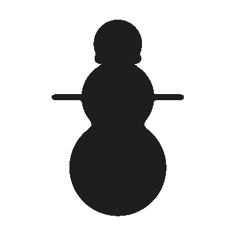
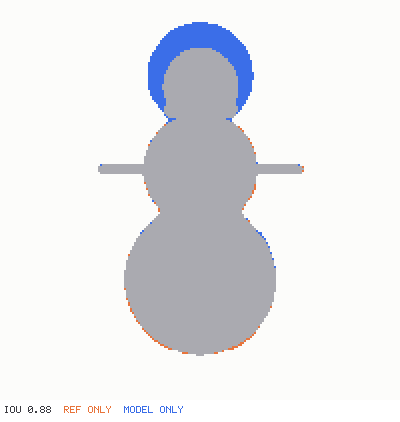

# Matching a reference

"Make it look like this sketch" usually has no feedback loop: the agent edits, looks, and
guesses whether it got closer. `compare_reference` turns it into a score that goes up and
sentences that say what to change.

```json
{ "scene": "snowman", "image": "refs/snowman-front.png", "view": "front" }
```

## What it does

1. **Finds the reference's silhouette.** If the PNG has transparency, the alpha channel is used.
   Otherwise the background is the color along the image border, flood-filled inward, so light
   areas *inside* the object (a white belly, a highlight) still count as the object.
2. **Renders the model's silhouette** from the same orthographic view.
3. **Normalizes both** to the same area around their centroids, then **registers** the reference
   onto the model with the scale and shift that overlap them best. The part of the shape that
   already matches sits on top of itself, and the difference stays where the change is.
4. **Scores** the overlap as IoU (1.0 = identical), and draws an overlay: gray where both have
   shape, orange where only the reference has it, blue where only the model has it.
5. **Explains** by comparing widths band by band from top to bottom. Bands that differ by more than
   12% become sentences naming the parts that occupy them, biggest difference first.

## Example

The reference is the snowman template's own silhouette. The model is the same snowman with its
head scaled 1.4×:

| reference | overlay |
|---|---|
|  |  |

```
IoU 0.88
• at 0–25% from the top (head) the model has shape the reference does not
```

The body is untouched, so only the head is reported. Scale the head back and the score returns
to 1.00.

## Getting good references

- **One object, whole, from one side**, matching the `view`: `front` looks at the model's face
  (+Z), `left` looks at its left side (+X), and so on. Orthographic turnarounds work best.
- **A background that differs from the object.** A white snowman on a white page cannot be
  separated. A transparent PNG always works.
- **PNG, 8-bit** (gray, RGB, RGBA or palette). Convert JPEGs first.
- Proportions are compared, not absolute size: a sketch at any scale or position works.

## Using it in a loop

Fix the biggest difference, compare again, and watch the score. When the advice says "the
reference has shape the model is missing" near a part, that part is too small or missing. When it
says "the model has shape the reference does not", it is too big, too long or extra.
`measure` gives the exact sizes to change, and `render { compare: "previous" }` shows what the
last edit did.

## Limits

- It compares silhouettes, not interior detail, colors or depth. Use several views (front and
  side) for 3D proportions.
- Strong perspective in a photo makes far parts look smaller than an orthographic render. Prefer
  flat, orthographic-looking references.
