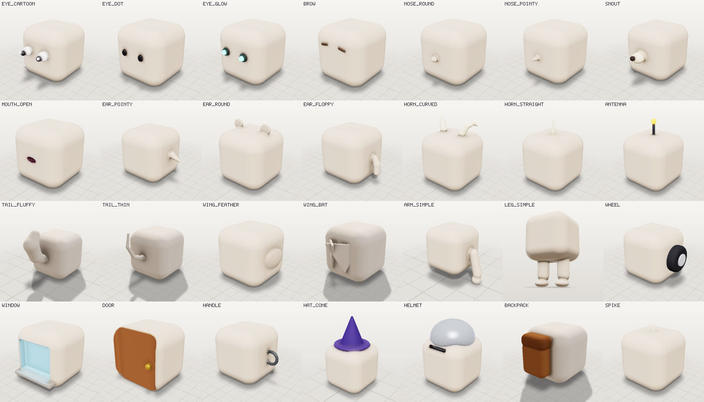

# Part library

> Generated by `scripts/gen-docs.ts`. The sheet is a real render of every part on a plain test body.

Reusable groups of parts, sized for a ~1 m character. Add one with an edit op: the root goes where
`attach` says, the rest hang off it, pairs mirror, and parts without a color take the color of
the part they sit on.

```json
{ "op": "add_library_part", "name": "eye_cartoon", "id": "eye", "attach": { "to": "head", "offset": [0.4, 0.1] }, "size": 1.2 }
```



| name | what it is | usual side | tags |
|---|---|---|---|
| `eye_cartoon` | Big cartoon eye: white, dark pupil and a highlight. Mirrored pair. | front | eye, face, character, cartoon |
| `eye_dot` | Small glossy dot eye, for stylized animals and toys. Mirrored pair. | front | eye, face, simple |
| `eye_glow` | Glowing lens eye in a dark socket. Mirrored pair. | front | eye, robot, sci-fi, monster |
| `brow` | A short eyebrow capsule; tilt it with rotation for anger or worry. Mirrored pair. | front | face, expression, character |
| `nose_round` | Soft round nose that blends into the face. | front | nose, face, character |
| `nose_pointy` | Long pointed nose along the surface normal. | front | nose, face, goblin, witch |
| `snout` | Animal snout with a dark nose tip. | front | nose, animal, face, dog, pig |
| `mouth_open` | An open mouth carved into the surface, dark inside. | front | mouth, face, expression |
| `ear_pointy` | Tall pointed ear angled outward. Mirrored pair. | left | ear, elf, goblin, cat, fox |
| `ear_round` | Round flat ear, like a bear or a mouse. Mirrored pair. | top | ear, bear, mouse, monkey |
| `ear_floppy` | Long floppy ear hanging down the side of the head. Mirrored pair. | left | ear, dog, rabbit |
| `horn_curved` | Curved horn that tapers to a point. Mirrored pair. | top | horn, demon, ram, monster |
| `horn_straight` | Straight spiral-free horn along the surface normal. | top | horn, unicorn, rhino |
| `antenna` | Thin antenna with a glowing ball on top. | top | robot, insect, sci-fi |
| `tail_fluffy` | Thick fluffy tail curving up. | back | tail, fox, squirrel, animal |
| `tail_thin` | Long thin tail with a gentle S curve. | back | tail, cat, rat, devil |
| `wing_feather` | Folded feathered wing lying against the body. Mirrored pair. | left | wing, bird, angel |
| `wing_bat` | Spread membrane wing, a flat triangle angled out and back. Mirrored pair. | back | wing, bat, dragon, demon |
| `arm_simple` | Hanging arm with a round hand. Mirrored pair. | left | arm, character, limb |
| `leg_simple` | Leg with a foot pointing forward. Mirrored pair. | bottom | leg, character, animal, limb |
| `wheel` | Rolling wheel with a hubcap, meshed on its own so it can spin. Mirrored pair. | left | wheel, vehicle, car, cart |
| `window` | A recessed window: glass carved into the wall with a sill below. | front | window, building, house, vehicle |
| `door` | A recessed wooden door with a round handle. | front | door, building, house |
| `handle` | A half-ring handle standing off a surface. | left | handle, prop, door, mug, bag |
| `hat_cone` | Tall cone hat with a brim. | top | hat, wizard, witch, party |
| `helmet` | Round metal helmet with a visor slit. | top | hat, knight, armor, soldier |
| `backpack` | A rounded backpack with a flap. | back | backpack, bag, adventurer, character |
| `spike` | A single spike along the surface normal; add several along a back. | top | spike, monster, dragon, armor |
