# Templates

> Generated by `scripts/gen-docs.ts`. Thumbnails are real renders.

Start from the closest one: `new_scene { "name": "…", "template": "<id>" }` or `clayform new <id>`.

## Biped character — `biped`

Stylized character ~1.1 m. Roles drive walk/idle/wave. Recolor via palette; swap head/hair shapes for species.

- tags: character, human, hero, npc
- parts: `body`, `head`, `hair`, `eye`, `nose`, `arm`, `hand`, `leg`, `foot`
- roles: body, head, eye, arm, leg
- palette: `skin` #f0c4a0, `shirt` #3f7cb3, `pants` #3a3f4b, `shoes` #5b3b2a, `hair` #4a2f22, `eye` #1f1d22
- clips: `walk` (walk), `idle` (idle)

## Quadruped — `quadruped`

Dog-like quadruped ~0.8 m long. Change ears, snout and tail for cat, fox, cow, dino.

- tags: animal, dog, cat, creature
- parts: `body`, `neck`, `head`, `snout`, `nose`, `eye`, `ear`, `leg_front`, `leg_back`, `paw_front`, `paw_back`, `tail`
- roles: body, head, eye, ear, leg, tail
- palette: `fur` #c98b52, `belly` #f1dcc0, `nose` #2a2224, `eye` #1c1a1e
- clips: `walk` (walk), `idle` (idle)

## Bird — `bird`

Round stylized bird ~0.35 m. fly and hop clips work out of the box.

- tags: animal, flying, creature
- parts: `body`, `chest`, `head`, `beak`, `eye`, `wing`, `tail`, `leg`, `toes`
- roles: body, head, eye, wing, tail, leg
- palette: `feather` #e2574c, `wing` #b83a33, `belly` #f6e2c8, `beak` #f2b233, `eye` #161418
- clips: `fly` (fly), `hop` (hop)

## Fish — `fish`

Stylized fish ~0.5 m, faces +Z. swim clip sways the tail.

- tags: animal, water, creature
- parts: `body`, `tail`, `fin_top`, `fin`, `eye`, `mouth`
- roles: body, tail, wing, eye
- palette: `scale` #f08a2c, `fin` #f4c55a, `eye` #141214, `white` #fbf6ee
- clips: `swim` (swim)

## Slime — `slime`

Blob creature ~0.5 m sculpted with inflate/dent — a sculpting example.

- tags: creature, monster, blob, sculpt
- parts: `blob`, `puddle`, `eye_white`, `pupil`
- roles: body, eye
- palette: `goo` #6fd06a, `eye` #1a1a1e, `white` #ffffff
- clips: `hop` (hop)

- sculpts: `top_bump` (inflate), `mouth` (crease)

## Robot — `robot`

Boxy robot ~1.2 m with glowing eyes and antenna.

- tags: character, mech, sci-fi
- parts: `torso`, `chest_light`, `head`, `neck`, `visor`, `eye`, `antenna`, `antenna_tip`, `arm`, `claw`, `leg`, `foot`
- roles: body, head, eye, arm, leg
- palette: `metal` #c7ccd4, `dark` #3a3e46, `glow` #5ff0c8, `accent` #f0a33a
- clips: `walk` (walk), `wave` (wave)

## Snowman — `snowman`

Classic three-ball snowman ~1.6 m.

- tags: character, winter, prop
- parts: `base`, `torso`, `head`, `scarf`, `nose`, `eye`, `button`, `arm`
- roles: body, head, arm
- palette: `snow` #f3f5f8, `carrot` #ea7a2e, `coal` #232326, `stick` #6b4a2b, `scarf` #c8403a
- clips: `wave` (wave)

## Toy car — `car`

Chunky toy car ~1.2 m. Wheels are separate so they spin in the drive clip.

- tags: vehicle, car
- parts: `chassis`, `cabin`, `windshield`, `window`, `bumper`, `bumper_back`, `headlight`, `wheel_front`, `wheel_back`, `hubcap_front`, `hubcap_back`
- roles: body, wheel
- palette: `paint` #d64533, `trim` #2b2d33, `glass` #9fd3e6, `tire` #26272b, `rim` #d9d9de, `light` #fff2b0
- clips: `drive` (drive)

## Spaceship — `spaceship`

Arcade fighter ~1.6 m long, faces +Z. Glowing engines.

- tags: vehicle, sci-fi, flying
- parts: `hull`, `nose`, `cockpit`, `wing`, `fin`, `engine`, `flame`
- roles: body
- palette: `hull` #e9ecef, `accent` #2f6fdb, `glass` #27354d, `glow` #58c8ff
- clips: `hover` (hover)

## Cottage — `house`

Small cottage ~2.4 m tall. Door and windows are carved; chimney on the roof.

- tags: building, house, environment
- parts: `walls`, `roof`, `door`, `window`, `window_side`, `chimney`, `step`
- roles: body
- palette: `wall` #efe3cf, `roof` #b4533b, `wood` #7a4d30, `glass` #8ec6dd, `stone` #8f8a84

## Tree — `tree`

Stylized tree ~2.6 m: tapered trunk + three canopy blobs with surface noise.

- tags: nature, environment, plant
- parts: `trunk`, `root`, `canopy`, `canopy_left`, `canopy_right`
- roles: body
- palette: `bark` #6f4a2e, `leaf` #4f9a45, `leaf_dark` #3b7a37
- clips: `sway` (idle)

## Rock — `rock`

Boulder with a smaller stone, noise displacement, moss and a flattened base.

- tags: nature, environment
- parts: `boulder`, `stone`
- roles: body
- palette: `stone` #8d8a85, `moss` #6e8a4b

- sculpts: `base` (flatten)

## Mushroom — `mushroom`

Toadstool ~0.5 m with spotted cap.

- tags: nature, prop
- parts: `cap`, `underside`, `stem`
- roles: head, body
- palette: `cap` #d63d34, `spot` #fbf4e6, `stem` #f1e6d2, `gill` #d8c6a9

## Crystal cluster — `crystal`

Glowing crystal cluster ~0.7 m on a rock base.

- tags: nature, magic, prop
- parts: `base`, `spire`, `shard_a`, `shard_b`, `shard_c`
- roles: body
- palette: `crystal` #7fd8ff, `core` #3a8fe0, `rock` #6f6a66

## Sword — `sword`

Hero sword ~1 m, lying along Y. Blade metal, gold guard, leather grip.

- tags: weapon, prop, item
- parts: `grip`, `pommel`, `guard`, `gem`, `blade`, `tip`
- roles: body
- palette: `steel` #c9ced6, `gold` #d9a441, `leather` #6b3f26, `gem` #4bb0e0

- sculpts: `fuller` (crease)

## Treasure chest — `chest`

Wooden chest ~0.9 m: half-round lid, metal bands, gold lock. Carve order matters — lid_cut only trims the lid parts listed before it.

- tags: prop, container, item
- parts: `lid`, `lid_band`, `lid_cut`, `box`, `band`, `lock`
- roles: body
- palette: `wood` #8a5a34, `wood_dark` #6e4527, `band` #6d6f75, `gold` #e0b04a

## Barrel — `barrel`

Wooden barrel ~0.8 m: an ellipsoid trimmed flat by intersect, vertical staves, iron hoops.

- tags: prop, container
- parts: `belly`, `trim`, `head`, `hoop_top`, `hoop_mid`, `hoop_bottom`
- roles: body
- palette: `wood` #9a6a3f, `wood_dark` #7a5230, `lid` #4a2e18, `iron` #5c5e63

## Potion — `potion`

Glowing potion bottle ~0.3 m.

- tags: item, magic, prop, effect
- parts: `bottle`, `neck`, `rim`, `cork`
- roles: body
- palette: `glass` #cfe7ef, `liquid` #9b5cff, `cork` #a8784c

- effects: `sparkle` (magic)

## Torch — `torch`

Wall-less standing torch ~0.7 m with a fire effect on top.

- tags: prop, fire, effect
- parts: `handle`, `bowl`, `coals`
- roles: body
- palette: `wood` #7a5032, `iron` #4d4f55, `ember` #ff8a3a

- effects: `flame` (fire)

## Knight — `knight`

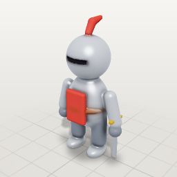

Small armored knight ~1.1 m holding a sword. Metal via palette; the sword is separate.

- tags: character, armor, medieval
- parts: `body`, `belt`, `tabard`, `head`, `visor`, `plume`, `arm`, `hand`, `leg`, `boot`, `blade`, `guard`
- roles: body, head, arm, leg
- palette: `steel` #b8bec8, `steel_dark` #7d8490, `cloth` #b83a33, `leather` #6b3f26, `gold` #d9a441, `eye` #1f1d22
- clips: `walk` (walk), `idle` (idle)

## Wizard — `wizard`

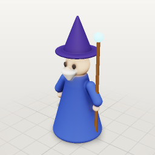

Robed wizard ~1.3 m with a long beard and a tall hat. Recolor the robe via palette.

- tags: character, magic, fantasy
- parts: `robe`, `head`, `beard`, `sleeve`, `hand`, `staff`, `orb`, `eye`, `nose`, `hat`, `hat_cone`
- roles: body, head, arm, eye
- palette: `robe` #3b4f9e, `robe_dark` #2b3a78, `skin` #f0c4a0, `beard` #e8e6e0, `hat` #3b2f6b, `staff` #6b4a2b, `gem` #7fe3ff
- clips: `idle` (idle)
- effects: `sparkle` (magic)

## Cat — `cat`

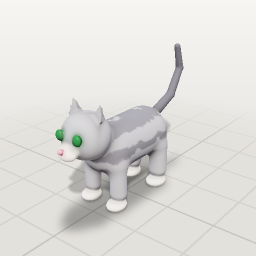

Sitting-height cat on four legs ~0.6 m long with pointed ears and a thin tail.

- tags: animal, pet, creature
- parts: `body`, `head`, `muzzle`, `nose`, `eye`, `ear`, `leg_front`, `leg_back`, `paw_front`, `paw_back`, `tail`
- roles: body, head, eye, ear, leg, tail
- palette: `fur` #9a9a9f, `fur_dark` #5f5f66, `belly` #e8e3db, `nose` #e08a9a, `eye` #2a6b3a
- clips: `walk` (walk), `idle` (idle)

## Frog — `frog`

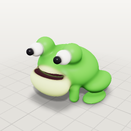

Squat cartoon frog ~0.35 m with big eyes on top and folded legs; hop clip included.

- tags: animal, creature, cute
- parts: `body`, `belly`, `eye`, `eye_white`, `pupil`, `mouth`, `thigh`, `foot`, `hand`
- roles: body, eye, leg, arm
- palette: `skin` #5fae4a, `belly` #d8e8a0, `eye` #1b1a1f, `white` #fbfbf5, `mouth` #3b1f2b
- clips: `hop` (hop)

## Penguin — `penguin`

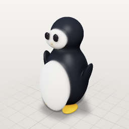

Round penguin ~0.5 m with flippers, a beak and orange feet.

- tags: animal, bird, creature
- parts: `body`, `front`, `head`, `face`, `beak`, `flipper`, `foot`, `eye`
- roles: body, head, wing, leg, eye
- palette: `black` #23262d, `white` #f3f3f0, `orange` #f2a33a
- clips: `walk` (walk)

## Teddy bear — `teddy`

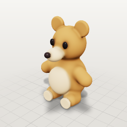

Plush teddy bear ~0.45 m sitting upright, with round ears and a stitched snout.

- tags: toy, prop, cute
- parts: `body`, `tummy`, `head`, `arm`, `leg`, `sole`, `ear`, `snout`, `snout_tip`, `eye`
- roles: body, head, arm, leg, ear, eye
- palette: `fur` #b07a48, `light` #e3c29a, `dark` #2a2224

## Ghost — `ghost`

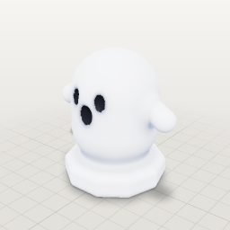

Floating cartoon ghost ~0.6 m with a wavy hem, glowing faintly; hover clip.

- tags: monster, spooky, creature
- parts: `body`, `hem`, `eye`, `mouth`, `arm`
- roles: body, eye, arm
- palette: `sheet` #eef1f6, `glow` #a9c8ff, `eye` #23262d
- clips: `hover` (hover)

## Baby dragon — `dragon`

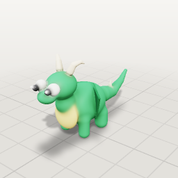

Chubby baby dragon ~0.7 m long with bat wings, horns, a spiked tail and a belly.

- tags: monster, fantasy, creature, flying
- parts: `body`, `belly`, `neck`, `head`, `snout`, `leg_front`, `leg_back`, `tail`, `eye`, `eye_pupil`, `eye_shine`, `horn`, `wing`, `spike`
- roles: body, head, leg, tail, eye, wing
- palette: `scale` #4aa36a, `belly` #f1d98a, `horn` #f2e6c8, `wing` #2f7a4b
- clips: `walk` (walk), `fly` (fly)

## Chicken — `chicken`

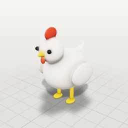

Plump chicken ~0.4 m with a comb, wattle, tail feathers and thin legs.

- tags: animal, bird, farm
- parts: `body`, `head`, `comb`, `beak`, `wattle`, `eye`, `wing`, `tail`, `leg`, `toes`
- roles: body, head, eye, wing, tail, leg
- palette: `feather` #f4efe4, `red` #d64533, `beak` #f2b233, `eye` #1b1a1f
- clips: `walk` (walk), `idle` (idle)

## Pickup truck — `truck`

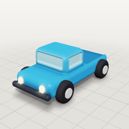

Toy pickup truck ~1.4 m with an open bed, headlights and spinning wheels.

- tags: vehicle, car
- parts: `chassis`, `cab`, `windshield`, `side_window`, `bed`, `bumper`, `headlight`, `wheel_front`, `wheel_front_hub`, `wheel_back`, `wheel_back_hub`
- roles: body, wheel
- palette: `paint` #2f7fb8, `trim` #2b2d33, `glass` #9fd3e6, `light` #fff2b0, `bed` #255f8a
- clips: `drive` (drive)

## Propeller plane — `plane`

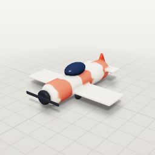

Chunky propeller plane ~1.5 m long, modeled in flight; the propeller spins in the spin clip.

- tags: vehicle, flying
- parts: `fuselage`, `cockpit`, `wing`, `tailplane`, `fin`, `nose`, `propeller`, `wheel`
- roles: body, rotor, wheel
- palette: `paint` #e8e2d2, `stripe` #d64533, `dark` #2b2d33, `glass` #27354d
- clips: `spin` (spin)

## Sailboat — `boat`

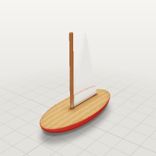

Small sailboat ~1.4 m long: hull, deck, mast and a triangle sail.

- tags: vehicle, water
- parts: `hull`, `deck_cut`, `deck`, `mast`, `sail`, `boom`
- roles: body
- palette: `hull` #c8403a, `deck` #b8865a, `sail` #f3efe6, `wood` #7a5032

## Cartoon rocket — `rocket`

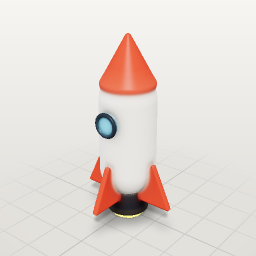

Retro rocket ~1.3 m with fins, a porthole and an engine glow; smoke trail effect.

- tags: vehicle, sci-fi, effect
- parts: `body`, `nose`, `window`, `rim`, `fin`, `fin_back`, `fin_front`, `nozzle`, `flame`
- roles: body
- palette: `body` #e8e6e0, `red` #d64533, `glass` #7fc6e8, `dark` #2b2d33, `glow` #ffb13b

- effects: `trail` (smoke)

## Castle tower — `tower`

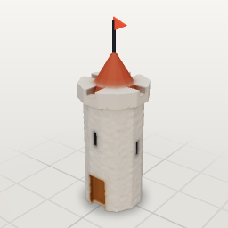

Round stone tower ~3.8 m with battlements, arrow slits, a door and a flag.

- tags: building, medieval, environment
- parts: `wall`, `ring`, `crenel`, `crenel_2`, `roof`, `door`, `slit`, `slit_side`, `pole`, `flag`
- roles: body
- palette: `stone` #9a948c, `roof` #7a3a2a, `wood` #6b4526, `flag` #d64533, `dark` #2b2d33

## Well — `well`

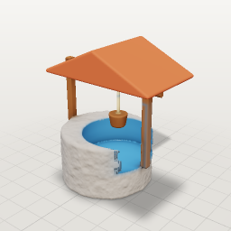

Stone well ~1.6 m with a wooden roof frame and a bucket.

- tags: building, prop, village
- parts: `ring`, `hole`, `post`, `roof`, `axle`, `rope`, `bucket`
- roles: body
- palette: `stone` #8f8a84, `wood` #7a5032, `roof` #a4553a, `water` #3a6f9a, `rope` #c8b38a

## Lamp post — `lamppost`

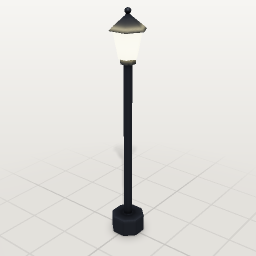

Victorian street lamp ~2.4 m with a glowing lantern head.

- tags: prop, street, light
- parts: `base`, `pole`, `collar`, `lantern`, `cap`, `finial`
- roles: body
- palette: `iron` #2f3238, `glass` #fff0b8

## Tent — `tent`

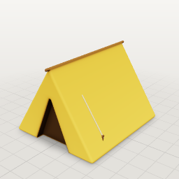

Camping tent ~1.3 m: a triangular canvas with an open flap and guy ropes.

- tags: prop, camp, environment
- parts: `canvas`, `door`, `ridge`, `rope`, `peg`
- roles: body
- palette: `canvas` #d9a441, `canvas_dark` #b8862f, `inside` #3a2a1a, `rope` #c8b38a, `peg` #6b4a2b

## Pine tree — `pine`

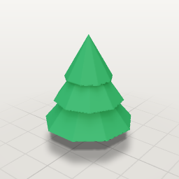

Stylized pine ~1.8 m with three stacked faceted tiers.

- tags: nature, environment, plant
- parts: `trunk`, `tier_low`, `tier_mid`, `tier_top`
- roles: body
- palette: `bark` #6f4a2e, `needle` #2f7a4b, `needle_dark` #225c38
- clips: `sway` (idle)

## Potted cactus — `cactus`

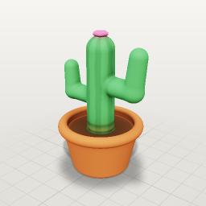

Saguaro-style cactus with two arms in a terracotta pot, ~0.7 m.

- tags: nature, plant, prop
- parts: `pot`, `rim`, `soil`, `stem`, `arm`, `arm_2`, `flower`
- roles: body
- palette: `cactus` #4f9a5a, `spine` #e8e2c8, `pot` #c26a3f, `soil` #4a3222, `flower` #e8649a

## Campfire — `campfire`

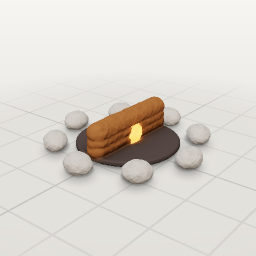

Crossed logs in a ring of stones with fire and a little smoke, ~0.8 m across.

- tags: prop, fire, camp, effect
- parts: `ash`, `log`, `log_2`, `log_3`, `embers`, `stone_0`, `stone_1`, `stone_2`, `stone_3`, `stone_4`, `stone_5`, `stone_6`, `stone_7`
- roles: body
- palette: `wood` #6f4a2e, `ash` #3a3432, `stone` #8f8a84, `ember` #ff8a3a

- effects: `fire` (fire), `smoke` (smoke)

## Wooden table — `table`

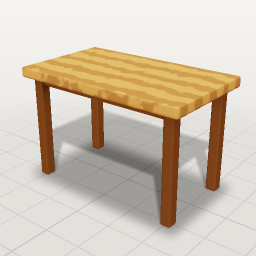

Tavern table ~1.2 m long on four legs.

- tags: furniture, prop, tavern
- parts: `top`, `leg`, `leg_back`, `rail`, `rail_back`
- roles: body
- palette: `wood` #b07c46, `wood_dark` #5e3c20

## Wooden chair — `chair`

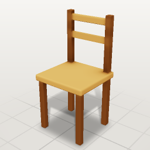

Simple chair ~0.9 m with a slatted back.

- tags: furniture, prop, tavern
- parts: `seat`, `leg`, `leg_back`, `post`, `slat`, `slat_2`
- roles: body
- palette: `wood` #b07c46, `wood_dark` #5e3c20

## Round shield — `shield`

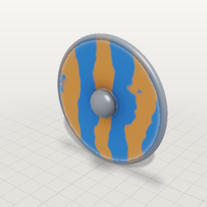

Viking-style round shield ~0.7 m with a metal rim and a boss.

- tags: weapon, prop, item
- parts: `board`, `rim`, `boss`
- roles: body
- palette: `wood` #9a6a3f, `paint` #2f5f9a, `metal` #8f949c

## Lantern — `lantern`

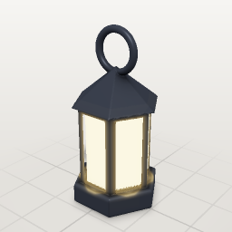

Hand lantern ~0.4 m with a glowing glass core, metal frame and ring handle.

- tags: prop, light, item
- parts: `base`, `frame`, `pane`, `glass`, `cap`, `handle`
- roles: body
- palette: `metal` #3a3e46, `glass` #ffd98a
