# Templates

> Generated by `scripts/gen-docs.ts`. Thumbnails are real renders.

Start from the closest one: `new_scene { "name": "…", "template": "<id>" }` or `clayform new <id>`.

## Biped character — `biped`

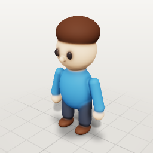

Stylized character ~1.1 m. Roles drive walk/idle/wave. Recolor via palette; swap head/hair shapes for species.

- tags: character, human, hero, npc
- parts: `body`, `head`, `hair`, `eye`, `nose`, `arm`, `hand`, `leg`, `foot`
- roles: body, head, eye, arm, leg
- palette: `skin` #f0c4a0, `shirt` #3f7cb3, `pants` #3a3f4b, `shoes` #5b3b2a, `hair` #4a2f22, `eye` #1f1d22
- clips: `walk` (walk), `idle` (idle)

## Quadruped — `quadruped`

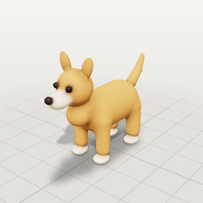

Dog-like quadruped ~0.8 m long. Change ears, snout and tail for cat, fox, cow, dino.

- tags: animal, dog, cat, creature
- parts: `body`, `neck`, `head`, `snout`, `nose`, `eye`, `ear`, `leg_front`, `leg_back`, `paw_front`, `paw_back`, `tail`
- roles: body, head, eye, ear, leg, tail
- palette: `fur` #c98b52, `belly` #f1dcc0, `nose` #2a2224, `eye` #1c1a1e
- clips: `walk` (walk), `idle` (idle)

## Bird — `bird`

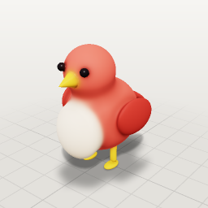

Round stylized bird ~0.35 m. fly and hop clips work out of the box.

- tags: animal, flying, creature
- parts: `body`, `chest`, `head`, `beak`, `eye`, `wing`, `tail`, `leg`, `toes`
- roles: body, head, eye, wing, tail, leg
- palette: `feather` #e2574c, `wing` #b83a33, `belly` #f6e2c8, `beak` #f2b233, `eye` #161418
- clips: `fly` (fly), `hop` (hop)

## Fish — `fish`

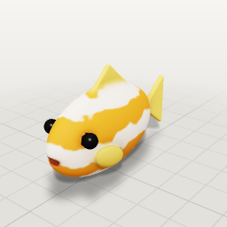

Stylized fish ~0.5 m, faces +Z. swim clip sways the tail.

- tags: animal, water, creature
- parts: `body`, `tail`, `fin_top`, `fin`, `eye`, `mouth`
- roles: body, tail, wing, eye
- palette: `scale` #f08a2c, `fin` #f4c55a, `eye` #141214, `white` #fbf6ee
- clips: `swim` (swim)

## Slime — `slime`

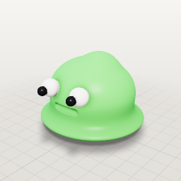

Blob creature ~0.5 m sculpted with inflate/dent — a sculpting example.

- tags: creature, monster, blob, sculpt
- parts: `blob`, `puddle`, `eye_white`, `pupil`
- roles: body, eye
- palette: `goo` #6fd06a, `eye` #1a1a1e, `white` #ffffff
- clips: `hop` (hop)

- sculpts: `top_bump` (inflate), `mouth` (crease)

## Robot — `robot`

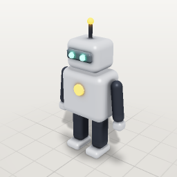

Boxy robot ~1.2 m with glowing eyes and antenna.

- tags: character, mech, sci-fi
- parts: `torso`, `chest_light`, `head`, `neck`, `visor`, `eye`, `antenna`, `antenna_tip`, `arm`, `claw`, `leg`, `foot`
- roles: body, head, eye, arm, leg
- palette: `metal` #c7ccd4, `dark` #3a3e46, `glow` #5ff0c8, `accent` #f0a33a
- clips: `walk` (walk), `wave` (wave)

## Snowman — `snowman`

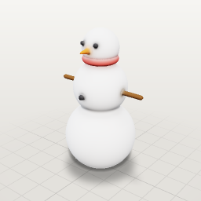

Classic three-ball snowman ~1.6 m.

- tags: character, winter, prop
- parts: `base`, `torso`, `head`, `scarf`, `nose`, `eye`, `button`, `arm`
- roles: body, head, arm
- palette: `snow` #f3f5f8, `carrot` #ea7a2e, `coal` #232326, `stick` #6b4a2b, `scarf` #c8403a
- clips: `wave` (wave)

## Toy car — `car`

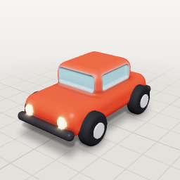

Chunky toy car ~1.2 m. Wheels are separate so they spin in the drive clip.

- tags: vehicle, car
- parts: `chassis`, `cabin`, `windshield`, `window`, `bumper`, `bumper_back`, `headlight`, `wheel_front`, `wheel_back`, `hubcap_front`, `hubcap_back`
- roles: body, wheel
- palette: `paint` #d64533, `trim` #2b2d33, `glass` #9fd3e6, `tire` #26272b, `rim` #d9d9de, `light` #fff2b0
- clips: `drive` (drive)

## Spaceship — `spaceship`

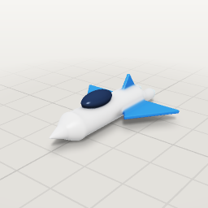

Arcade fighter ~1.6 m long, faces +Z. Glowing engines.

- tags: vehicle, sci-fi, flying
- parts: `hull`, `nose`, `cockpit`, `wing`, `fin`, `engine`, `flame`
- roles: body
- palette: `hull` #e9ecef, `accent` #2f6fdb, `glass` #27354d, `glow` #58c8ff
- clips: `hover` (hover)

## Cottage — `house`

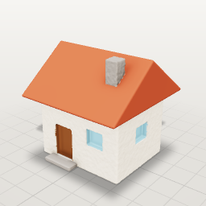

Small cottage ~2.4 m tall. Door and windows are carved; chimney on the roof.

- tags: building, house, environment
- parts: `walls`, `roof`, `door`, `window`, `window_side`, `chimney`, `step`
- roles: body
- palette: `wall` #efe3cf, `roof` #b4533b, `wood` #7a4d30, `glass` #8ec6dd, `stone` #8f8a84

## Tree — `tree`

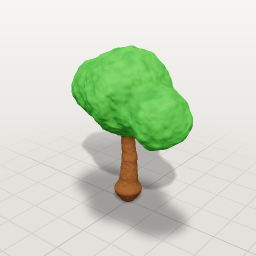

Stylized tree ~2.6 m: tapered trunk + three canopy blobs with surface noise.

- tags: nature, environment, plant
- parts: `trunk`, `root`, `canopy`, `canopy_left`, `canopy_right`
- roles: body
- palette: `bark` #6f4a2e, `leaf` #4f9a45, `leaf_dark` #3b7a37
- clips: `sway` (idle)

## Rock — `rock`

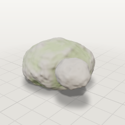

Boulder with a smaller stone, noise displacement, moss and a flattened base.

- tags: nature, environment
- parts: `boulder`, `stone`
- roles: body
- palette: `stone` #8d8a85, `moss` #6e8a4b

- sculpts: `base` (flatten)

## Mushroom — `mushroom`

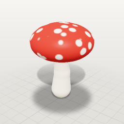

Toadstool ~0.5 m with spotted cap.

- tags: nature, prop
- parts: `cap`, `underside`, `stem`
- roles: head, body
- palette: `cap` #d63d34, `spot` #fbf4e6, `stem` #f1e6d2, `gill` #d8c6a9

## Crystal cluster — `crystal`

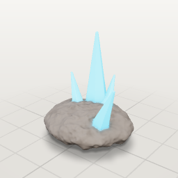

Glowing crystal cluster ~0.7 m on a rock base.

- tags: nature, magic, prop
- parts: `base`, `spire`, `shard_a`, `shard_b`, `shard_c`
- roles: body
- palette: `crystal` #7fd8ff, `core` #3a8fe0, `rock` #6f6a66

## Sword — `sword`

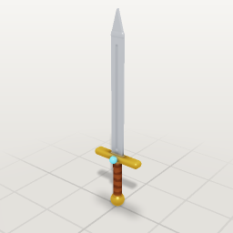

Hero sword ~1 m, lying along Y. Blade metal, gold guard, leather grip.

- tags: weapon, prop, item
- parts: `grip`, `pommel`, `guard`, `gem`, `blade`, `tip`
- roles: body
- palette: `steel` #c9ced6, `gold` #d9a441, `leather` #6b3f26, `gem` #4bb0e0

- sculpts: `fuller` (crease)

## Treasure chest — `chest`

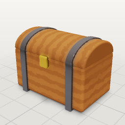

Wooden chest ~0.9 m: half-round lid, metal bands, gold lock. Carve order matters — lid_cut only trims the lid parts listed before it.

- tags: prop, container, item
- parts: `lid`, `lid_band`, `lid_cut`, `box`, `band`, `lock`
- roles: body
- palette: `wood` #8a5a34, `wood_dark` #6e4527, `band` #6d6f75, `gold` #e0b04a

## Barrel — `barrel`

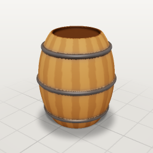

Wooden barrel ~0.8 m: an ellipsoid trimmed flat by intersect, vertical staves, iron hoops.

- tags: prop, container
- parts: `belly`, `trim`, `head`, `hoop_top`, `hoop_mid`, `hoop_bottom`
- roles: body
- palette: `wood` #9a6a3f, `wood_dark` #7a5230, `lid` #4a2e18, `iron` #5c5e63

## Potion — `potion`

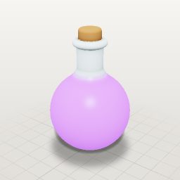

Glowing potion bottle ~0.3 m.

- tags: item, magic, prop, effect
- parts: `bottle`, `neck`, `rim`, `cork`
- roles: body
- palette: `glass` #cfe7ef, `liquid` #9b5cff, `cork` #a8784c

- effects: `sparkle` (magic)

## Torch — `torch`

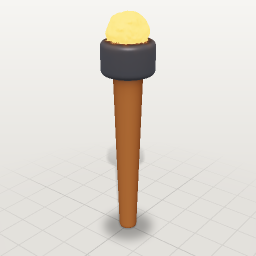

Wall-less standing torch ~0.7 m with a fire effect on top.

- tags: prop, fire, effect
- parts: `handle`, `bowl`, `coals`
- roles: body
- palette: `wood` #7a5032, `iron` #4d4f55, `ember` #ff8a3a

- effects: `flame` (fire)
